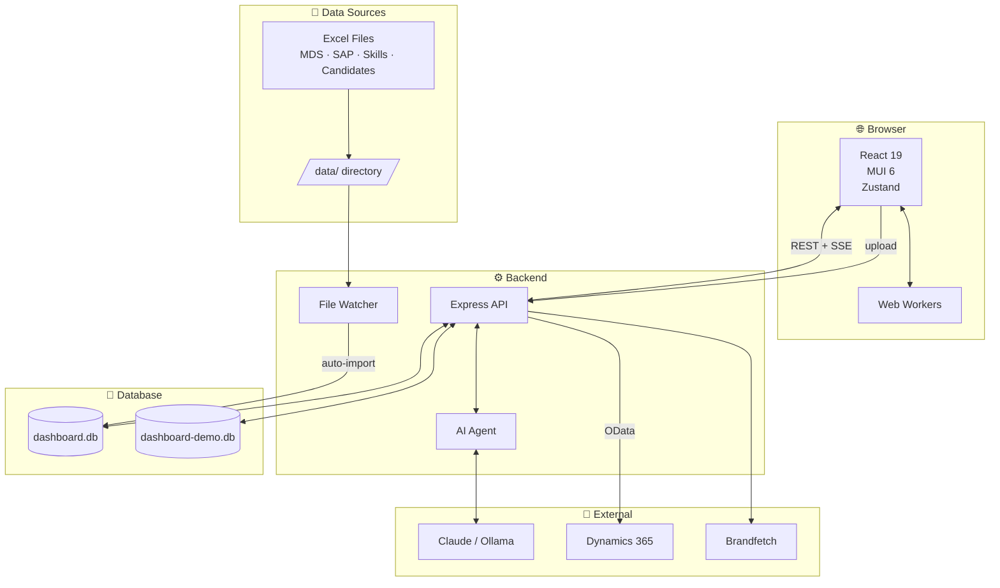
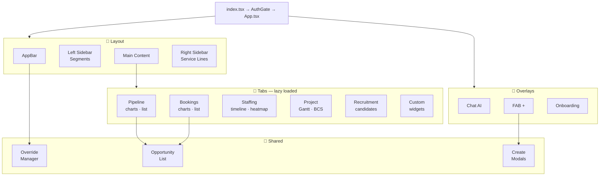
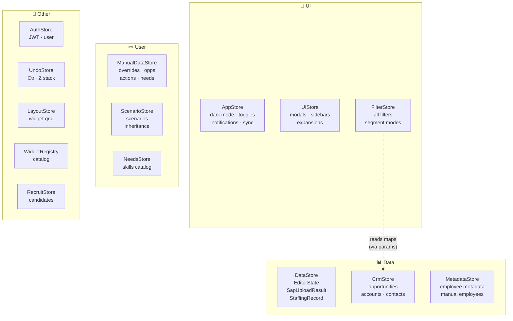
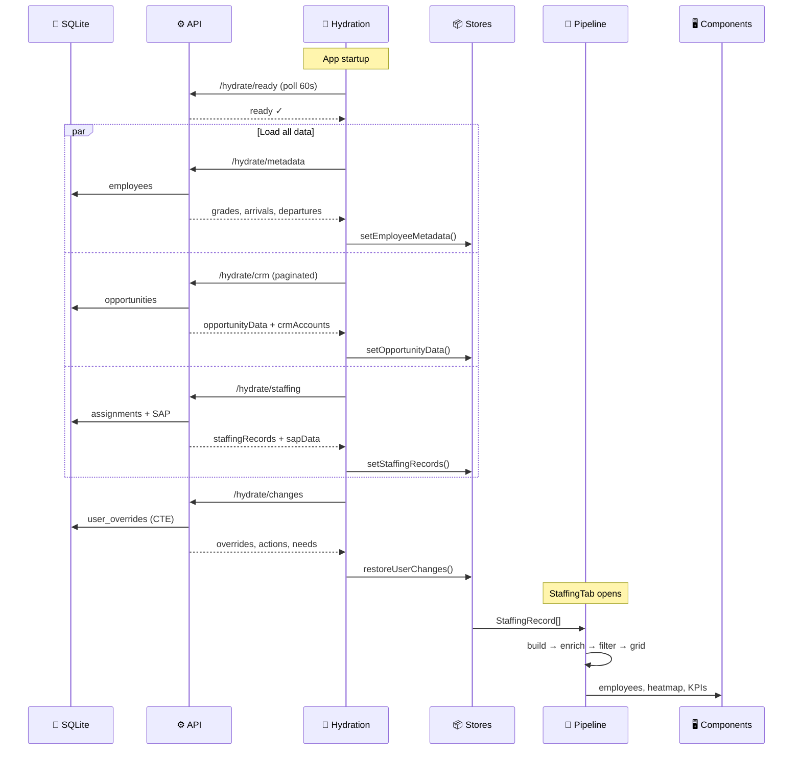
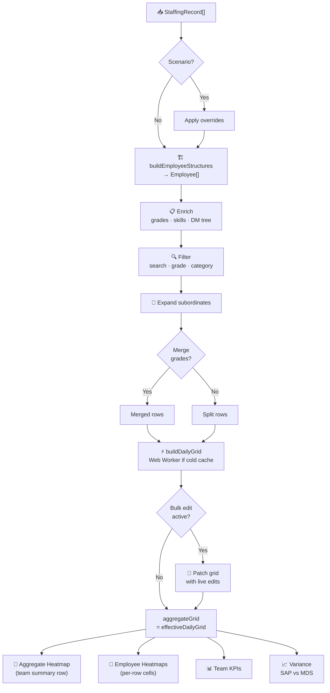
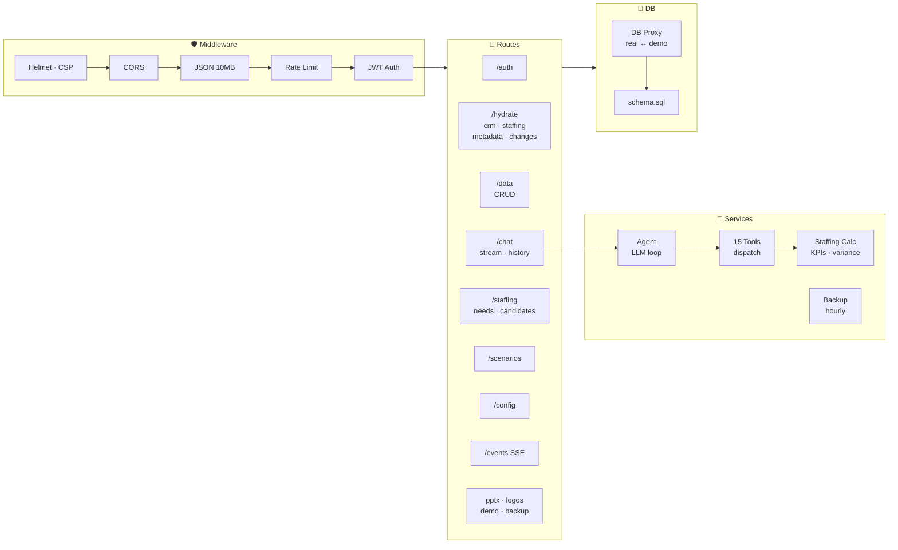
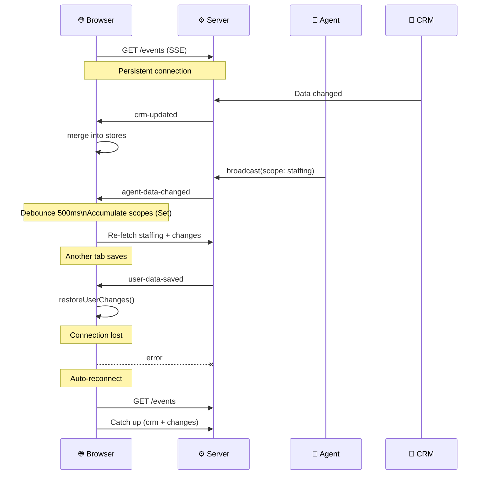
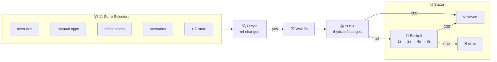
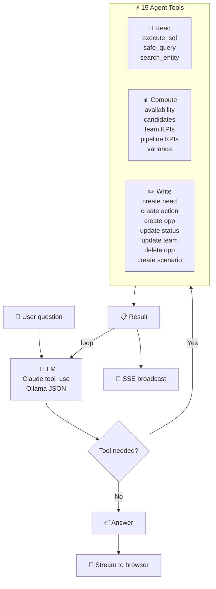
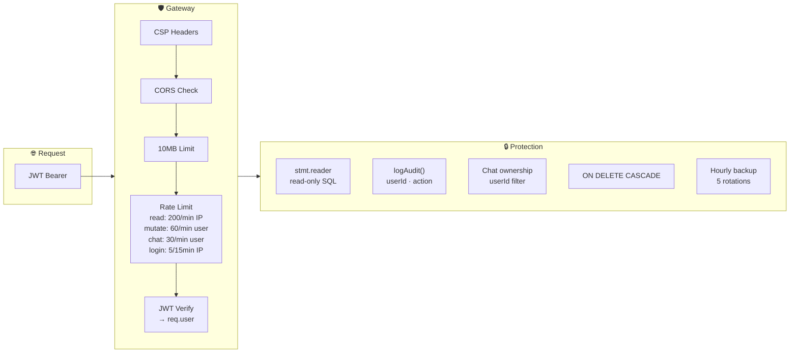

# Architecture

## 1. System Overview

The application is split into two parts that talk to each other: a **frontend** running in the user's browser, and a **backend** running on a server.

The frontend is a Single Page Application (SPA) — it loads once and then updates dynamically without full page reloads. It's built with React (a library for building user interfaces), uses Material UI for the visual components (buttons, tables, charts), and Zustand for managing the application's data in memory.

The backend is a Node.js server using Express. It handles all the data: reading from and writing to the database, talking to external services (CRM, AI), and watching for new files. The database is SQLite — a lightweight, file-based database that doesn't need a separate server.

Data enters the system from three sources:
1. **Excel files** — staffing plans (MDS), timesheets (SAP), employee skills, and recruitment candidates. These files are dropped into a `data/` folder. A file watcher detects them automatically and imports them into the database.
2. **Dynamics 365 CRM** — sales opportunities, accounts, and contacts are fetched from BearingPoint's CRM system via its API.
3. **Manual user input** — users can create opportunities, accounts, staffing needs, and override statuses directly in the app.

The app has a **demo mode** with a separate database containing fake data, so it can be presented to clients or stakeholders without exposing real employee information. The AI assistant connects to either Claude (Anthropic's cloud AI) or Ollama (a local AI running on the same machine).

**Why these choices:**
- **SQLite** instead of PostgreSQL or MySQL: it's a single file, requires zero setup, and is fast enough for 1-20 simultaneous users. It ships with the app — no separate database server to install or maintain.
- **Express** instead of more complex frameworks like NestJS: it's lightweight and well-known. The API is simple REST endpoints — no need for a heavy framework.
- **React 19**: the latest version includes features like `startTransition` and `useDeferredValue` that let the app stay responsive even when processing heavy data (hundreds of employees × hundreds of days).
- **Two databases**: the demo database lets you showcase the app safely. The switch is instant and transparent — all routes work with both databases without any code changes.

> **Glossary:**
> - **SPA (Single Page Application)**: A web app that loads once and updates content dynamically, without navigating to new pages. Feels like a desktop app.
> - **REST**: A standard way for the frontend to talk to the backend using HTTP requests (GET to read, POST to create, PUT to update, DELETE to remove).
> - **SSE (Server-Sent Events)**: A way for the server to push updates to the browser in real time over a persistent HTTP connection. Unlike WebSocket, it's one-directional (server → browser only).
> - **SQLite**: A database engine that stores everything in a single file. No server process needed — the app reads/writes directly.
> - **OData**: A standard protocol for querying data from Microsoft services like Dynamics 365.
> - **Web Worker**: A way to run heavy JavaScript calculations in a background thread, so the main UI thread stays responsive.
> - **Brandfetch**: A third-party service that looks up company logos by domain name.

---

## 2. Frontend Architecture

When you open the app in your browser, it loads through three stages: `index.tsx` (the entry point) → `AuthGate` (checks if you're logged in) → `App.tsx` (the main shell).

The **shell** is the permanent frame that's always visible: a top bar (AppBar) with navigation tabs and toggle buttons, a left sidebar for segment filters, a right sidebar for service line filters, and a main content area in the center. Both sidebars can be collapsed to give more space to the content.

The main content area shows one of **6 tabs**: Pipeline (sales opportunities in progress), Bookings (won deals), Staffing (employee assignments and utilization), Project (job timelines and BCS simulator), Recruitment (candidate pipeline), and Custom Dashboard (user-built widget layout). Each tab is **lazy loaded** — its code is only downloaded when you first click on it, which makes the initial page load faster.

Three **overlay components** float above everything: the AI Chat panel (accessible from any tab), the floating action button (+) for creating new items, and a 5-step onboarding tour for first-time visitors.

**Shared components** are used across multiple tabs. The OpportunityList (a paginated table of sales opportunities with inline editing) appears in both Pipeline and Bookings. The create modals (for opportunities, accounts, staffing needs) can be triggered from any tab via the floating action button. The Status Override Manager (accessible from the AppBar) provides a central place to manage all user modifications.

**Why this structure:**
- **Lazy loading**: Pipeline and Bookings together represent ~200KB of JavaScript. Loading them only when needed means the app starts faster — you see the landing page in under 1 second.
- **Permanent sidebars**: Filters for segments and service lines apply to both Pipeline and Bookings. If they were inside each tab, switching tabs would lose your filter selections.
- **Shared OpportunityList**: Pipeline shows opportunities with status 1-11 (in progress), Bookings shows status 11-15 (won/lost). Same component, different filters — no code duplication.

> **Glossary:**
> - **Lazy loading**: Loading code only when it's needed, instead of all upfront. Reduces initial page load time.
> - **ErrorBoundary**: A React component that catches crashes in its children and shows a fallback UI instead of a blank page.
> - **Suspense**: A React feature that shows a loading placeholder while lazy-loaded components are being downloaded.
> - **FAB (Floating Action Button)**: A circular button that floats above the content, commonly used for the primary "create" action.
> - **Shell**: The permanent frame of the app (header, sidebars, footer) that stays visible while tab content changes.

---

## 3. Zustand Store Map

The app's data lives in 13 **stores** — think of each store as a shared notebook that any component can read from or write to. When a store's data changes, only the components that use that specific data re-render (update visually).

The stores are grouped into 4 categories:

**UI stores** manage what the user sees and interacts with. AppStore holds global settings (dark mode on/off, which revenue type to display, sync status). UIStore tracks which modals are open, which sidebars are collapsed, which rows are expanded. FilterStore holds all active filters (selected segments, service lines, date ranges) and receives data from CrmStore as function parameters — never by reaching into CrmStore directly.

**Data stores** hold the raw business data. DataStore contains the staffing pipeline results: employee editor states (typed as `EditorState`), SAP data (typed as `SapUploadResult`), and staffing records (typed as `StaffingRecord[]`). CrmStore holds CRM opportunities, accounts, contacts, and lookup maps. MetadataStore holds employee-level information (grades, arrival/departure dates, manual employees).

**User modification stores** hold everything the user has manually changed. ManualDataStore holds status overrides, manually created opportunities, actions, staffing needs, and revenue team allocations. When a manual opportunity is deleted, all associated data is cleaned up automatically through a centralized cascade helper. ScenarioStore holds what-if scenarios — each scenario can inherit from a parent and override specific assignments.

**Other stores** handle authentication (AuthStore), undo history (UndoStore for Ctrl+Z), custom dashboard layout (LayoutStore), available widgets (WidgetRegistry), and recruitment candidates (RecruitmentStore).

A key design rule: **no store directly reads from another store in its actions**. If FilterStore needs data from CrmStore, the component that uses FilterStore passes the CrmStore data as a parameter. This keeps stores independent, testable, and prevents hidden dependencies.

**Why Zustand instead of Redux or React Context:**
- **No boilerplate**: Redux requires actions, action types, reducers, and dispatch calls. Zustand stores are just functions — each store is 50-200 lines of code.
- **Selective re-renders**: Components subscribe to specific fields. If you only read `darkMode` from AppStore, your component won't re-render when `syncStatus` changes.
- **Works outside React**: `getState()` can be called from event handlers, Web Workers, or SSE callbacks — not just from React components.

> **Glossary:**
> - **Store**: A shared piece of state (data) that multiple components can read from and write to. Changes trigger automatic UI updates.
> - **Zustand**: A lightweight state management library for React. Pronounced "zoo-shtand" (German for "state").
> - **Selector**: A function that picks specific fields from a store. Only the selected fields trigger re-renders when they change.
> - **Cascade delete**: When you delete a parent item (e.g., an opportunity), all child items (actions, needs) are automatically deleted too.
> - **Re-render**: When React updates a component's visual output because its data changed.

---

## 4. Data Flow: Database → Screen

When you open the app, it doesn't show data immediately. First, it needs to **hydrate** — load all the data from the backend database into the browser's memory (the Zustand stores).

The hydration process works in stages:

1. **Wait for backend**: The app polls the server every second (with random jitter to avoid all users hitting at the same moment) for up to 60 seconds, waiting for the database to be ready. A progress message tells you what's happening ("Connecting to backend...").

2. **Load data in parallel**: Once ready, four requests fire simultaneously:
   - Employee **metadata** (grades, arrival/departure dates) — loaded first because other data depends on it
   - CRM **opportunities** (paginated — loaded in chunks of 5000 to avoid browser memory issues)
   - **Staffing** assignments (MDS data) + **SAP** actuals (timesheet data)
   Each step updates the progress message ("Loading CRM data...", "Loading staffing...").

3. **Restore user changes**: Finally, the app loads all modifications the user has made (status overrides, manual opportunities, actions, staffing needs, revenue team allocations, employee metadata, and scenarios) from the `user_*` tables. This uses an optimized SQL query (ROW_NUMBER window function) to get only the latest value for each overridden field.

The order matters: metadata must be set before SAP data (because SAP processing needs grade information), and SAP before staffing (because the staffing data pipeline is triggered when staffing records arrive).

When you navigate to the **StaffingTab**, the loaded data goes through a computation pipeline: raw records → Employee objects → enriched with metadata → filtered by your active filters → transformed into a daily grid (one cell per employee per day). This grid is what renders the colored heatmap you see on screen.

**Why paginated CRM loading:**
- A large CRM can have 100,000+ opportunities. Loading them all at once would freeze the browser for several seconds and risk running out of memory. Pagination loads data in manageable chunks.

**Why ETag caching:**
- Each data endpoint computes a fingerprint (combining the row count and latest update timestamp). If the data hasn't changed since the last request, the server responds with "304 Not Modified" — no data is transferred. This makes page refreshes nearly instant when nothing has changed.

> **Glossary:**
> - **Hydration**: Loading data from the server into the browser's memory so the app can display it.
> - **Pagination**: Loading data in chunks (pages) instead of all at once. Each page contains a fixed number of items (e.g., 5000).
> - **ETag**: A fingerprint of the data. The browser sends it with the next request; if the server's fingerprint matches, no data needs to be sent.
> - **CTE (Common Table Expression)**: A way to write complex SQL queries in a readable format. Used here with ROW_NUMBER to get the latest override for each field.
> - **Jitter**: Adding a small random delay to polling intervals so that multiple browsers don't all hit the server at the exact same moment.
> - **304 Not Modified**: An HTTP response that means "nothing has changed since you last asked" — the browser uses its cached data.

---

## 5. Staffing Data Pipeline

The StaffingTab is the most complex feature. It transforms raw staffing records (a flat list of "employee X is assigned to project Y from date A to date B at Z% utilization") into a visual heatmap showing each employee's workload across time.

The transformation happens through a chain of **pure functions** — each one takes data in and produces data out, with no side effects:

1. **Scenario check**: If the user has activated a "what-if" scenario, the raw data is modified according to the scenario's overrides. Scenarios can inherit from parent scenarios (e.g., "Q4 plan" builds on "Q3 actual").

2. **Build Employee structures**: The flat records are grouped by employee and transformed into rich objects with sorted assignments, consolidated time periods, and pre-built search indexes (for fast filtering).

3. **Enrich**: Employee objects are decorated with grade history (tracking promotions), skills (from the skills Excel), and manager hierarchy (who reports to whom).

4. **Filter**: The list is narrowed based on the user's active filters — text search, grade levels, job categories, segments, service lines, availability threshold.

5. **Expand subordinates**: When grouping by manager, subordinates are recursively included under their manager.

6. **Grade transitions**: If an employee was promoted mid-year (e.g., from Consultant to Senior Consultant in June), they're split into two virtual rows — one for each grade. The user can toggle whether these appear merged or split.

7. **Build Daily Grid**: The heaviest step. For each employee × each day in the visible timeline, it computes a `DailyCell` containing: segment breakdown (what % goes to which project), capping (total can't exceed 100%), scale factors (for proportional display), SAP actual overlay (if timesheet data exists), and forecast comparison. This runs in a **Web Worker** (background thread) when the cache is empty, so the UI doesn't freeze.

8. **Bulk Edit Patching**: If the user is editing assignments in the Bulk Edit panel, the daily grid is patched in real time with the pending changes. `useBulkEditPatching` takes the base `effectiveDailyGrid` and applies live edits to produce `aggregateGrid`. When no edits are in progress, `aggregateGrid` is just `effectiveDailyGrid` passed through unchanged.

9. **Output**: The `aggregateGrid` feeds three consumers:
   - The **Aggregate Heatmap Strip** (team-level summary row at the top) — calls `computeAggregateHeatmapCells()` on the grid to produce one cell per time bucket across all employees
   - The **individual Employee Heatmap Strips** — each employee's row reads its own cells from the grid
   - The **Team KPIs** and **variance calculations** (comparing SAP actuals to MDS forecast)

**Why Web Workers:**
- The daily grid computation processes every employee × every day. For 200 employees over 365 days, that's 73,000 cells. Each cell requires segment classification, utilization capping, and SAP/MDS comparison. This takes 500ms-2s — long enough to make the UI feel frozen. Running it in a background thread keeps the interface responsive.
- The scoring optimizer (which matches employees to staffing needs using a multi-dimensional scoring matrix) takes 1-5 seconds. Same solution: a Web Worker computes the proposals in the background while the user continues interacting with the app.

> **Glossary:**
> - **Pure function**: A function that always gives the same output for the same input, and doesn't modify anything outside itself. Easy to test and debug.
> - **DailyCell**: One cell in the heatmap grid — represents one employee on one day. Contains utilization breakdown, scale factors, and SAP/forecast overlay.
> - **Capping**: When an employee's total utilization exceeds 100%, individual segments are scaled down proportionally so the total displayed never exceeds 100%.
> - **Scale factor**: A multiplier (0 to 1) applied to each segment's display width when utilization exceeds 100%. Priority: absence > chargeable > general opportunity > training.
> - **SAP**: The company's ERP/timesheet system. "SAP actuals" = what was actually recorded in timesheets.
> - **MDS**: "Mission Data Sheet" — the staffing plan. "MDS forecast" = what was planned.
> - **Variance**: The difference between what was planned (MDS) and what actually happened (SAP). Positive = more work than planned.
> - **Cold cache**: When the app first loads the grid, there's no previous data to reuse. Every cell must be computed from scratch. On subsequent pans (scrolling the timeline), previously computed cells are reused from the cache.

---

## 6. Backend API Structure

Every request from the browser to the server passes through 5 **middleware** layers — think of them as security checkpoints that a request must pass through before reaching its destination:

1. **Helmet**: Adds security headers to every response. The most important is the Content Security Policy (CSP), which tells the browser to only load scripts and styles from trusted sources — preventing cross-site scripting attacks.

2. **CORS**: Checks that the request comes from an allowed origin (domain). In production, only the dashboard's own domain is allowed. This prevents other websites from making requests to the API.

3. **JSON Parser**: Parses the request body as JSON, with a 10MB size limit. This prevents attackers from sending enormous payloads that could crash the server.

4. **Rate Limiter**: Limits how many requests each user can make per minute. Different limits for different actions: reading data (200/min per IP), modifying data (60/min per user), chat messages (30/min per user), login attempts (5 per 15 minutes per IP). Uses the JWT username for mutation/chat limits so that one user can't block others.

5. **JWT Auth**: Validates the authentication token. If valid, attaches the user's identity to the request so that routes can check permissions and log who did what. If JWT_SECRET is not configured, this step is skipped entirely (development mode).

After passing all checkpoints, the request reaches one of the **route groups**:
- `/hydrate` — loads data with caching (ETag) and pagination
- `/chat` — handles AI conversations with real-time streaming
- `/data` — CRUD operations on employees, opportunities, assignments
- `/staffing` — staffing needs and candidate matching
- `/scenarios` — what-if scenario management
- `/events` — persistent SSE connection for real-time updates
- Plus: PPTX export, logo resolution, demo mode, backup, configuration

Routes call **services** for complex logic. The agent service orchestrates multi-step AI conversations. The staffing calculator runs availability, KPI, and variance computations server-side. The backup service runs automatically every hour.

All routes access the database through a **transparent proxy**. The proxy forwards all database calls to either the real database or the demo database, based on a runtime flag. No route code needs to know which database is active — the switch is invisible.

> **Glossary:**
> - **Middleware**: Code that runs between receiving a request and handling it. Like airport security — every traveler (request) passes through the same checkpoints.
> - **CORS (Cross-Origin Resource Sharing)**: A security mechanism that controls which websites can make requests to the API. Prevents unauthorized sites from accessing your data.
> - **CSP (Content Security Policy)**: A header that tells the browser which sources are allowed to load scripts, styles, images, etc. Blocks injected malicious scripts.
> - **Rate limiting**: Capping how many requests a user or IP can make in a time window. Prevents abuse and denial-of-service.
> - **CRUD**: Create, Read, Update, Delete — the four basic database operations.
> - **Proxy**: An intermediary that forwards requests to the right destination. Here, it routes database calls to either the real or demo database.

---

## 7. Real-Time Communication (SSE)

When the app loads, the browser opens a **persistent connection** to the server's `/api/events` endpoint. This connection stays open as long as the browser tab is open. The server can push messages through it at any time — the browser doesn't need to keep asking "has anything changed?"

This is called **Server-Sent Events (SSE)**. It's a simpler alternative to WebSocket: the server talks to the browser (one-way), while the browser talks to the server through regular REST requests.

Four types of events flow through this connection:

1. **crm-updated**: When the CRM poller detects that opportunities, accounts, or contacts have changed in Dynamics 365, it pushes only the changed items (a "delta"). The browser merges these into the existing data using a key-based merge function — no need to reload everything.

2. **agent-data-changed**: When the AI assistant creates a staffing need, updates a status, or makes any data change, it broadcasts which area was affected (the "scope": CRM, staffing, or user changes). The browser collects all scopes for 500 milliseconds (in case the AI makes several changes in rapid succession), then re-fetches only the affected data. Using a Set ensures no scope is lost if multiple events arrive.

3. **user-data-saved**: When you have the app open in two browser tabs and save data in one tab, this event tells the other tab to refresh its data. This prevents the tabs from getting out of sync.

4. **notification**: Triggers the notification bell to update its count. Used for CRM changes, new staffing needs created by the AI, overdue actions, etc.

If the connection drops (network glitch, server restart), the browser automatically reconnects — this is built into the native EventSource API. On reconnection, it re-fetches CRM data and user changes to catch up on anything it missed during the disconnection.

**Why SSE instead of WebSocket:**
- SSE is simpler: it works over regular HTTP, doesn't need a special upgrade handshake, and is supported natively by all browsers. We only need server→browser push (not bidirectional) because the browser already sends data via REST endpoints. WebSocket would be overkill.

> **Glossary:**
> - **SSE (Server-Sent Events)**: A technology where the server pushes data to the browser through a persistent HTTP connection. Simpler than WebSocket, one-directional (server → browser).
> - **WebSocket**: A two-way communication channel between browser and server. More complex than SSE but allows browser → server push too.
> - **Persistent connection**: An HTTP connection that stays open instead of closing after each request. The server can send data through it at any time.
> - **Delta**: Only the items that changed, not the entire dataset. Saves bandwidth and processing.
> - **Debounce**: Waiting a short time (here 500ms) before acting, in case more events arrive. Batches multiple rapid events into a single action.
> - **EventSource**: The browser's built-in API for receiving SSE events. Handles reconnection automatically.

---

## 8. Auto-Save & Sync

There's no "Save" button in this app. Every change you make is automatically saved to the database. Here's how it works:

The `useBackendSync` hook watches 10 data sources in the Zustand stores: status overrides, manual opportunities, manual accounts, editor states, actions, staffing needs, revenue team allocations, employee metadata, manual employees, and scenarios.

When any of these change, Zustand creates a new JavaScript reference for that piece of data. The sync hook detects this by comparing the current reference to the previous one — if they're different, that section is "dirty" (has unsaved changes).

The hook doesn't save immediately. It **debounces** for 2 seconds — meaning it waits 2 seconds after the last change before saving. If you make 10 rapid edits in 2 seconds (e.g., typing in a field), only one save request is sent, not 10.

After the debounce, only the dirty sections are sent to the server via POST. On success, the reference is updated so the same data isn't sent again. The sync status indicator in the top bar shows: a spinner while saving, a checkmark when saved, and a warning icon if saving failed.

If the save fails (e.g., the server is temporarily unreachable), the hook retries with **exponential backoff**: wait 1 second, try again; if that fails, wait 2 seconds; then 4 seconds; then 8 seconds. After 4 failed attempts, it gives up and shows the error status. The dirty data is not lost — it will be included in the next save attempt when the connection recovers.

**Why debounce 2 seconds:**
- Without debouncing, typing "Hello" in a field would trigger 5 separate save requests (one per keystroke). Two seconds is long enough to batch rapid edits, but short enough that you see "saved" quickly after finishing.

**Why exponential backoff instead of fixed retry:**
- If the server is restarting (takes ~5 seconds), fixed 3-second retries would send 2 requests during the restart, all failing. Exponential backoff (1→2→4→8s) spaces out retries progressively, reducing server load while still recovering quickly once it's back.

> **Glossary:**
> - **Debounce**: Delaying an action until a quiet period has passed. Like an elevator door — it waits for people to stop entering before closing.
> - **Exponential backoff**: Doubling the wait time between retry attempts (1s, 2s, 4s, 8s...). Prevents overwhelming a recovering server.
> - **Reference equality**: In JavaScript, two objects are "equal" only if they point to the same memory location. Zustand creates new references on every mutation, making change detection instant.
> - **Dirty**: Data that has been modified in memory but not yet saved to the server.
> - **Hook**: In React, a function that lets you "hook into" React features like state and lifecycle from a regular function (not a class).

---

## 9. AI Agent Tool Loop

The AI assistant is not a simple chatbot — it's an **agent** that can take actions on your data. When you ask "Who is available next month?", it doesn't just generate text. It queries the database, computes availability calculations, and returns structured results.

Here's the step-by-step process:

1. **User sends a message**: The message is sent to the backend along with the conversation history and optional scoring configuration (how strictly to match candidates).

2. **LLM decides**: The message + history are sent to the Large Language Model (Claude or Ollama). The LLM can either answer directly or request to use a tool. Claude uses its native `tool_use` capability (structured tool calls with JSON schema); Ollama returns a JSON string that the backend parses.

3. **Tool dispatch**: If the LLM requests a tool, the dispatch map routes to the correct handler. There are 15 tools in three categories:
   - **Read tools** query data without changing it: `execute_sql` (run a SELECT query), `safe_query` (pre-built query patterns), `search_entity` (find employees/opportunities/accounts by name)
   - **Compute tools** run calculations: `compute_availability` (who is free when), `find_staffing_candidates` (score employees against a need), `get_team_kpis` (utilization metrics), `get_pipeline_kpis` (revenue forecasts), `get_sap_mds_variance` (actual vs plan comparison)
   - **Write tools** modify data: `create_staffing_need`, `create_action`, `create_opportunity`, `update_opportunity_status`, `update_revenue_team`, `delete_opportunity`, `create_scenario`

4. **Result fed back**: The tool's result is sent back to the LLM, which decides whether it needs another tool or can now answer. This loop can repeat multiple times (e.g., first search for an entity, then compute its availability, then create a staffing need).

5. **Write tools broadcast**: When a write tool modifies data, it broadcasts an SSE event so the browser updates in real time. The user sees the change appear without refreshing.

6. **Final answer streamed**: Once the LLM has all the information it needs, it generates a final answer. This is streamed to the browser word-by-word via SSE `text_delta` events, so the user sees the response being typed in real time.

**Why tool_use instead of free-form function calling:**
- Claude's native tool_use provides structured JSON tool calls with schema validation. The LLM outputs exactly which tool to call and with which parameters, validated against a schema. This is more reliable than asking the LLM to generate raw JSON and hoping it's valid.

**Why stmt.reader for SQL queries:**
- The `execute_sql` tool lets the LLM write and run SQL queries on your data. This is powerful but dangerous: a prompt injection could trick the LLM into running `DELETE FROM employees`. Keyword blocking (checking for INSERT, UPDATE, DELETE in the query text) can be bypassed with clever encoding tricks. Instead, we use SQLite's `stmt.reader` property — a built-in check that returns true only if the prepared statement is genuinely read-only. This is enforced by the database engine itself and cannot be tricked by SQL manipulation.

> **Glossary:**
> - **Agent**: An AI that can take actions (not just generate text). It decides which tools to use and in what order to accomplish a task.
> - **LLM (Large Language Model)**: The AI model that understands natural language and generates responses. Claude (by Anthropic) or Ollama (local, open-source).
> - **Tool use / Function calling**: A capability where the AI can request to run specific functions (tools) with specific parameters, instead of just generating text.
> - **Prompt injection**: A technique where a malicious user crafts their message to trick the AI into performing unintended actions (like deleting data).
> - **stmt.reader**: A property of SQLite's prepared statement that is true only if the query is read-only (SELECT). Cannot be fooled by SQL tricks — it's checked at the database engine level.
> - **Streaming**: Sending the response piece by piece (word by word) as it's generated, instead of waiting for the complete response. The user sees the text appearing in real time.

---

## 10. Security

Security is designed in **layers** — even if one layer is bypassed, the others still protect the data. Think of it as a building with multiple locked doors, not just one.

### Layer 1: Network security (Helmet + CORS)
**Helmet** adds security headers to every HTTP response. The most important is the Content Security Policy (CSP), which tells the browser: "only execute scripts from our own domain, only load styles from our domain and Google Fonts, only connect to our API." This blocks cross-site scripting (XSS) attacks — even if an attacker somehow injects JavaScript into the page, the browser will refuse to run it because it doesn't come from a trusted source.

**CORS** prevents other websites from making requests to our API. Without it, a malicious website could make requests to our server using the user's browser cookies.

### Layer 2: Input validation (JSON limit + rate limiting)
The **JSON parser** rejects any request body larger than 10MB. Without this limit, an attacker could send a 1GB payload to crash the server. The **rate limiter** caps requests per minute: 200 for reads (per IP), 60 for data modifications (per authenticated user), 30 for AI chat (per user), and 5 login attempts per 15 minutes (per IP). This prevents brute-force attacks on passwords and denial-of-service on expensive endpoints (like AI chat).

### Layer 3: Authentication (JWT)
When you log in, the server creates a **JSON Web Token** (JWT) — a cryptographically signed string that proves your identity. The browser stores it in localStorage and sends it with every request. The server verifies the signature and extracts your username. If the token is expired or tampered with, the request is rejected.

If `JWT_SECRET` is not configured (development mode), authentication is completely disabled — all endpoints are public. This is intentional for local development.

### Layer 4: Data protection
- **stmt.reader**: AI-generated SQL queries are checked by SQLite's engine before execution. Only genuine read-only statements are allowed. No keyword-based blocking can be bypassed.
- **logAudit()**: Every data modification records who did it, what they did, which entity was affected, and when. This creates an audit trail for compliance.
- **Chat session ownership**: Chat sessions use `crypto.randomUUID()` (unguessable random IDs) and are linked to the authenticated user. The `/history` endpoint only returns sessions belonging to the current user.
- **ON DELETE CASCADE**: Foreign key constraints ensure data integrity. Deleting an employee automatically deletes their assignments, skills, and SAP records — no orphaned data.

### Layer 5: Recovery
- **Automatic backup**: Every hour, all user data is backed up to a JSON file. The last 5 backups are kept, older ones are rotated out. If the database is accidentally deleted or corrupted, user data is automatically restored from the latest backup on next startup.
- **Graceful shutdown**: When the server receives a shutdown signal (Ctrl+C or system restart), it flushes all pending database writes (WAL checkpoint) before closing, preventing data loss.

**Why JWT instead of server-side sessions:**
- The frontend is a SPA that communicates via REST API. JWT tokens work seamlessly: the browser adds the token to every request header, and SSE connections pass it as a URL parameter. No session storage needed on the server, no cookie management, no CSRF tokens.

> **Glossary:**
> - **JWT (JSON Web Token)**: A signed string that proves who you are. Contains your username and expiration date, signed with a secret key. The server can verify it without looking up a database.
> - **CSP (Content Security Policy)**: A security header that restricts what the browser is allowed to load. Prevents cross-site scripting by blocking scripts from untrusted domains.
> - **CORS (Cross-Origin Resource Sharing)**: A mechanism that controls which websites can make requests to the API. Prevents unauthorized cross-site requests.
> - **XSS (Cross-Site Scripting)**: An attack where an attacker injects malicious JavaScript into a web page. CSP is the primary defense.
> - **Rate limiting**: Restricting how many requests a user/IP can make in a given time window. Prevents abuse.
> - **Audit trail**: A log of every action taken by every user, used for security reviews and compliance.
> - **WAL (Write-Ahead Log)**: SQLite's mechanism for safe concurrent writes. A checkpoint flushes pending changes to the main database file.
> - **Foreign key**: A database constraint that links two tables (e.g., "this assignment belongs to this employee"). CASCADE means deleting the parent automatically deletes the children.
> - **crypto.randomUUID()**: A function that generates a random, unguessable 128-bit identifier (e.g., `a1b2c3d4-e5f6-7890-abcd-ef1234567890`).
